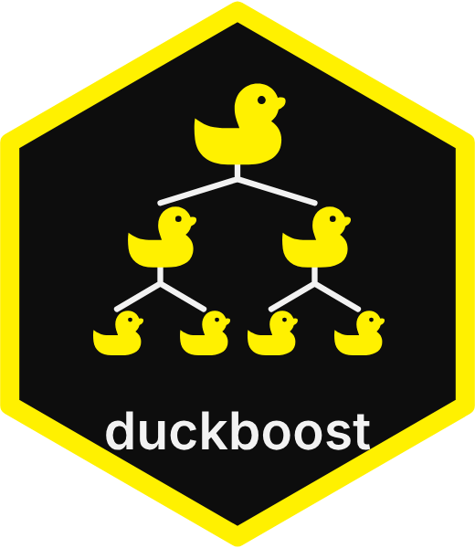

# duckboost 

Experimental DuckDB extension for **SQL-native gradient boosting**: train a dependency-free histogram GBDT inside DuckDB (`backend = 'native'`), evaluate and inspect in SQL, export pure SQL for orbital-style inference, and optionally import XGBoost / LightGBM / CatBoost dumps when you need their full toolbox.

**Documentation:** <https://javorraca.github.io/duckboost/> · [Native trainer vignette](https://javorraca.github.io/duckboost/vignettes/native-trainer.html)

Standalone [extension-template](https://github.com/duckdb/extension-template) repository targeting DuckDB 2.0. The `duckdb` submodule is pinned to `v2.0-cyanoptera`.

## Motivation

[Orbital](https://posit-dev.github.io/orbital/) converts trained sklearn / tidymodels pipelines into SQL so scoring needs no Python runtime. `duckboost` brings a similar loop fully into DuckDB:

1. **Train** with the built-in native histogram trainer (or an optional vendor backend / imported dump)
2. **Evaluate** fit quality and feature importance in SQL
3. **Export** model trees to DuckDB SQL (`CASE WHEN` ensembles, optional `separate_trees`)
4. **Score** with either `duckboost_predict` or the exported SQL (no extension required at inference time)

## Build

Initialize the submodules, then build the release shell and loadable extension:

```bash
git submodule update --init --recursive
make
# or
GEN=ninja make
```

The shell is `./build/release/duckdb`. Tests:

```bash
make test
```

Load a local unsigned build:

```bash
./build/release/duckdb -unsigned
```

```sql
LOAD '<path>/build/release/extension/duckboost/duckboost.duckdb_extension';
```

Optional native trainer flags (XGBoost / LightGBM train via vendor C API → dump → import):

```bash
# Link real libraries (pip wheels work; set ROOT or rely on auto-detect under ~/.local)
EXT_FLAGS='-DDUCKBOOST_WITH_XGBOOST=ON -DDUCKBOOST_WITH_LIGHTGBM=ON' make release

# Compile #ifdef paths without linking vendor libraries
EXT_FLAGS='-DDUCKBOOST_WITH_XGBOOST=ON -DDUCKBOOST_NATIVE_STUB_ONLY=ON' make release
```

CatBoost has no public in-process training C API — use `duckboost_import('catboost', ...)`.

Inspect the active build:

```sql
SELECT * FROM duckboost_build_info();
SELECT * FROM duckboost_backends();
```

Native train tests (linked builds only). GitHub Actions workflow **Native trainers** builds with the pinned pip wheels and runs the same test:

```bash
export LD_LIBRARY_PATH="$HOME/.local/lib/python3.12/site-packages/xgboost/lib:$HOME/.local/lib/python3.12/site-packages/lightgbm/lib:${LD_LIBRARY_PATH}"
DUCKBOOST_NATIVE_TRAIN_TEST=1 make test T=test/sql/duckboost/native_train.test
```

Before opening a PR that touches C++ sources, run `make format-check` (or `make format-fix`) so CI Format Check stays green.

See [`PACKAGING.md`](PACKAGING.md) for the community-extension descriptor and native-trainer flags.

## SQL API

```sql
LOAD duckboost;

-- Available backends
SELECT * FROM duckboost_backends();

-- Train (native histogram GBDT; 'reference' remains a compatible alias)
CREATE TABLE models AS
SELECT duckboost_train(
	y,
	[x1, x2],
	MAP {
		'backend': 'native',
		'task': 'regression',
		'n_estimators': '20',
		'max_depth': '3',
		'learning_rate': '0.1',
		'feature_names': 'x1,x2'
	}
) AS model
FROM train;

-- In-process predict
SELECT duckboost_predict(model, [x1, x2]) FROM models, test;

-- Dataset-level metrics
SELECT duckboost_evaluate_agg(model, y, [x1, x2], MAP {'metric': 'rmse'})
FROM models, test;

-- Orbital-style SQL export (trees as separate columns for DuckDB parallelism)
SELECT duckboost_to_sql(
	model,
	'test',
	['x1', 'x2'],
	MAP {'separate_trees': 'true', 'prediction_alias': 'pred'}
) FROM models;

-- Import a vendor dump trained outside DuckDB
SELECT duckboost_import('xgboost', xgb_dump_json, MAP {'task': 'binary', 'base_score': '0.0'});
SELECT duckboost_import('lightgbm', lgb_model_txt);
SELECT duckboost_import('catboost', catboost_model_json);

-- Table macros (query_table wrappers; pass table names as VARCHAR literals)
CREATE TABLE models AS
FROM duckboost_fit('train', y, [x1, x2], options := MAP {'n_estimators': '20', 'feature_names': 'x1,x2'});

SELECT * FROM duckboost_score((SELECT model FROM models), 'test', [x1, x2]);

-- Multiclass: labels are class indices 0 .. n_classes - 1 (n_classes inferred, or set 'n_classes')
CREATE TABLE mc_models AS
SELECT duckboost_train(label, features, MAP {'task': 'multiclass', 'n_estimators': '20'}) AS model
FROM mc_train;

-- predict returns argmax class index; predict_proba returns softmax LIST
SELECT duckboost_predict(model, features), duckboost_predict_proba(model, features) FROM mc_models, mc_test;

-- Robust and asymmetric regression losses (reference backend)
SELECT duckboost_train(y, features, MAP {'objective': 'absolute_error'}) AS mae_model FROM train;
SELECT duckboost_train(
	y, features, MAP {'objective': 'quantile', 'quantile_alpha': '0.9'}
) AS q90_model FROM train;
SELECT duckboost_train(
	y, features, MAP {'objective': 'expectile', 'tau': '0.9'}
) AS e90_model FROM train;

-- Loss-guided (leaf-wise) growth spends a fixed leaf budget on the best available split
SELECT duckboost_train(
	y, features, MAP {'growth_policy': 'lossguide', 'max_leaves': '31'}
) AS leafwise_model FROM train;

-- Oblivious / symmetric trees share one split per depth (CatBoost-style)
SELECT duckboost_train(
	y, features, MAP {'growth_policy': 'oblivious', 'max_depth': '4'}
) AS oblivious_model FROM train;

-- Sample weights / class_weight, early stopping, and feature importance
SELECT duckboost_train(y, features, weight, MAP {
	'task': 'binary',
	'class_weight': 'balanced',
	'n_estimators': '50',
	'early_stopping_rounds': '5',
	'validation_fraction': '0.2',
	'reg_lambda': '1.0',
	'seed': '42'
}) AS model FROM train;

-- Or pass an external validation mask (e.g. from duckboost_initial_validation_split)
SELECT duckboost_train(
	y, features, split = 'validation',
	MAP {'early_stopping_rounds': '5', 'n_estimators': '50', 'seed': '42'}
) AS model
FROM data
WHERE split IN ('train', 'validation');

SELECT * FROM duckboost_importance(model);  -- variable, gain, cover, frequency, importance
```

Feature `NULL`s are treated as missing (NaN): the reference trainer learns an XGBoost-style `default_left` direction per split, and `duckboost_to_sql` emits matching `IS NULL OR isnan(...)` branches.

### Example datasets

[`data/`](data/) ships two small datasets to learn with. Run from the repository root:

```sql
LOAD duckboost;
CREATE TABLE iris AS FROM read_csv('data/iris.csv');                          -- 150 rows
CREATE TABLE penguins AS FROM read_csv('data/penguins.csv', nullstr = 'NA');  -- 344 rows

-- Binary: is a (non-setosa) iris virginica?
CREATE TABLE iris_binary AS
SELECT (species = 'virginica')::DOUBLE AS y,
       [sepal_length, sepal_width, petal_length, petal_width] AS features
FROM iris WHERE species <> 'setosa';

SELECT duckboost_evaluate_agg(model, y, features, MAP {'metric': 'accuracy'})
FROM (SELECT duckboost_train(y, features, MAP {'task': 'binary'}) AS model FROM iris_binary), iris_binary;
```

The [example datasets vignette](https://javorraca.github.io/duckboost/vignettes/datasets.html) walks through train/validation/test splits, one-hot encoding, regression, binary classification, and a SQL grid search on both files.

### Splitting and preprocessing

Small macros borrow the ideas (not the code) of tidymodels' rsample and recipes:

```sql
-- Split: adds split = 'train' | 'test' (or 'train' | 'validation' | 'test'), or fold = 1 .. v
CREATE TABLE penguins_split AS
FROM duckboost_initial_split('penguins', prop := 0.75, strata := species, seed := 42);
FROM duckboost_initial_validation_split('penguins', prop := [0.6, 0.2], strata := species);
FROM duckboost_vfold('penguins_train', v := 5, strata := species);

-- Preprocess: learn values on training rows only ("prep") ...
CREATE TABLE prep AS
SELECT median(bill_length_mm) AS bill_length_mm, duckboost_levels(island) AS island_levels
FROM penguins_split WHERE split = 'train';

-- ... then apply them to every row ("bake")
SELECT list_concat(
         [coalesce(s.bill_length_mm, p.bill_length_mm)],
         duckboost_dummy(s.island, p.island_levels, one_hot := true)) AS features,
       duckboost_dummy_names('island', p.island_levels, one_hot := true) AS island_names
FROM penguins_split s, prep p;
```

Also `duckboost_integer(x, levels)` (integer encoding) and `duckboost_other(x, levels)` (pool rare levels). The [splitting and preprocessing vignette](https://javorraca.github.io/duckboost/vignettes/split-and-preprocess.html) explains train/test versus train/validation/test versus cross-validation, and walks through a complete example.

### Backends

| Backend | Train in this build | Dump import | Predict / evaluate / `to_sql` |
| --- | --- | --- | --- |
| `native` (alias `reference`) | Yes (built-in histogram GBDT; JSON still says `"reference"`) | duckboost JSON | Yes |
| `xgboost` | Optional (`DUCKBOOST_WITH_XGBOOST`) | `dump_model(..., dump_format='json')` | Yes |
| `lightgbm` | Optional (`DUCKBOOST_WITH_LIGHTGBM`) | `booster_.save_model()` text | Yes |
| `catboost` | Optional (`DUCKBOOST_WITH_CATBOOST`) | `save_model(..., format='json')` float trees | Yes |

Lead with `backend='native'` for dependency-free training. Opt into vendor C API linking with `DUCKBOOST_WITH_*` when you want XGBoost / LightGBM inside the same process; prefer `duckboost_import()` when you already train outside DuckDB. [Use cases and choosing a trainer](https://javorraca.github.io/duckboost/use-cases.html) and the [native trainer vignette](https://javorraca.github.io/duckboost/vignettes/native-trainer.html) compare the paths and publish small holdout benchmarks.

### Dump import notes

- Imported models set `learning_rate = 1.0`. XGBoost and LightGBM dump leaf values already include their learning-rate shrinkage, so they are imported unchanged; CatBoost `scale_and_bias` is applied at import.
- Unknown XGBoost dump fields and LightGBM tree fields fail loudly (no silent skips). Named XGBoost dumps require `feature_names` in scoring-column order; positional `f0..fN` dumps do not.
- XGBoost categorical splits (`split_condition` arrays) import as `EQUAL`/`IN` nodes with `category_cast=xgboost` (`trunc(x)` for `x >= 0`). Pass `config` from `Booster.save_config()` to recover `base_score` / objective / `num_class`.
- LightGBM numerical `<=` splits preserve `default_left` and `missing_type` (`None`, `Zero`, or `NaN`) while converting to duckboost `<` via `nextafter(threshold, +∞)`. Categorical bitsets import as `IN` set-membership nodes with `category_cast=lightgbm` (`trunc(x)` membership). Unsupported objectives (`poisson`, `multiclassova`, ranking, RF `average_output`, linear trees) are rejected.
- CatBoost support: `FloatFeature`, `OneHotFeature`, and `OnlineCtr` (Counter/Borders). CTR combinations may include `cat_feature_value`, `float_feature`, and `cat_feature_exact_value`. Pass categorical CityHash values as numeric features.
- Multiclass CatBoost JSON uses class-blocked `leaf_values` (`2^depth` values per class). Import expands each oblivious tree into `n_classes` duckboost trees (layout `[round][class]`).
- OnlineCtr requires `ctr_data` in the dump (`save_model(..., pool=...)`). `duckboost_to_sql` inlines CTR hash lookups via `UHUGEINT` modular arithmetic.
- Optional import map keys: `task`, `base_score`, `learning_rate`, `feature_names`, `n_classes`, `config` (XGBoost `save_config()` JSON; mutually exclusive with `base_score`).

## Model format

Models are opaque `VARCHAR` JSON documents. `ToJSON` writes the lowest format version that can represent the model (`1` for plain LESS/NaN/L2 trees; `2` when the model uses `IN` splits, non-NaN `missing_type`, non-L2 objectives, or non-exact `category_cast`). `FromJSON` rejects versions newer than this build supports.

```json
{
  "duckboost_version": 1,
  "backend": "reference",
  "task": "regression",
  "base_score": 0.0,
  "learning_rate": 0.1,
  "n_features": 2,
  "n_classes": 1,
  "feature_names": ["x1", "x2"],
  "trees": [{"nodes": [{"is_leaf": false, "feature": 0, "threshold": 1.5, "left": 1, "right": 2, "value": 0.0}, ...]}]
}
```

For `task: "multiclass"`, `n_classes >= 2`, optional `base_scores` holds per-class bias, and trees are stored as `round * n_classes + class`. `duckboost_predict` returns the argmax class index; `duckboost_to_sql` exports an argmax over per-class score expressions. Pass `keep_columns` (comma-separated names or `*`) to retain identity columns, and `proba=true` for binary/multiclass probability columns beside the prediction.

Split nodes may use `"compare":"equal"` with `threshold`, or `"compare":"in"` with a sorted, unique `categories` array. Equality and membership matches route right; non-matches route left. Optional `"category_cast":"lightgbm"|"xgboost"` controls fractional-category truncation.

## Design notes

- **Layout**: standalone community extension ([extension-template](https://github.com/duckdb/extension-template)) so optional vendor ML libraries stay out of core DuckDB builds. The `duckdb` submodule tracks DuckDB 2.0 (`v2.0-cyanoptera`).
- **SQL export** mirrors orbital's `separate_trees` idea so DuckDB can evaluate ensemble members as independent columns.
- **Native histogram trainer** (`backend='native'`, alias `'reference'`) is a dependency-free GBDT: global quantile pre-binning, ordered target-statistic categorical partitions (`EQUAL`/`IN`), and depth-wise, loss-guided, or oblivious/symmetric growth. It supports squared-error, absolute-error, quantile, expectile, logistic, and softmax losses plus missing-value defaults, L1/L2/`gamma`, sample weights, and early stopping. Set `categorical_features` to comma-separated feature names or zero-based indices. It buffers rows and bin ids in memory, finds continuous splits from those histograms (depth-wise, loss-guided, and oblivious/symmetric), trains single-threaded, and is aimed at SQL-native workflows rather than replacing production XGBoost/LightGBM/CatBoost at every scale. Model JSON still serializes `"backend":"reference"` for compatibility. `duckboost_predict` caches a parsed model within each chunk when the JSON repeats; for large scoring jobs prefer `duckboost_to_sql`.
- **Native LightGBM** maps absolute_error / quantile / lossguide / `categorical_features` / `subsample` (`bagging_freq=1`) / seed. Native XGBoost focuses on L2 depth-wise trees (plus seed / `max_bin` / sample weights / `SaveJsonConfig` intercept). Both native backends honor `early_stopping_rounds` with either `validation_fraction` (random hold-out) or a BOOLEAN `is_validation` column (LightGBM uses `early_stopping_round`, XGBoost evaluates each iter and truncates the dump). `class_weight` is folded into sample weights.
- **Table macros** `duckboost_fit` / `duckboost_score` wrap `duckboost_train` / `duckboost_predict` with `query_table` for a compact SQL workflow.
- **Split and preprocessing macros** are plain SQL macros registered by the extension. Splits rank rows by a hash of the row's values mixed with `seed`, so they are reproducible and independent of physical row order.

## Roadmap

- [x] Native trainer scaffolding behind `DUCKBOOST_WITH_*` / `DUCKBOOST_NATIVE_STUB_ONLY` + `duckboost_build_info()`
- [x] Vendor C API bridges for XGBoost / LightGBM (train → dump → import into `BoostModel`)
- [x] Standalone extension-template repository (`Makefile`, `extension_config.cmake`, [`docs/community_extensions_description.yml`](docs/community_extensions_description.yml))
- [x] Split helpers (train/test, train/validation/test, v-fold) and preprocessing helpers (dummy/one-hot, integer encoding, rare-level pooling)
- [x] Missing-value aware splits, sample weights / `class_weight`, early stopping, regularization, and `duckboost_importance`
- [x] Fail-loud vendor imports, categorical cast semantics, model format v2, deployable `to_sql` (`keep_columns` / `proba`), vendor parity fixtures
- [x] Native-linked CI, native early stopping, LightGBM `kZeroThreshold` predict parity
- [x] Histogram pre-binning, ordered-TS categoricals, oblivious growth, vendor-free quality probes
- [x] Docs rebrand: `backend='native'` alias, Pages refresh, native-trainer vignette + holdout benchmarks
- [x] Medium-scale native vs LightGBM holdout benchmark (`scripts/native_benchmark/`)
- [ ] Submit [`docs/community_extensions_description.yml`](docs/community_extensions_description.yml) to `duckdb/community-extensions` after DuckDB 2.0 is released
