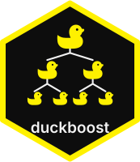

`duckboost` is an experimental [DuckDB](https://duckdb.org/) extension for **SQL-native gradient boosting**. Train a histogram gradient-boosted decision trees (“GBDT”) inside DuckDB with zero vendor libraries, score with SQL functions, export trees as ordinary SQL, and optionally import XGBoost / LightGBM / CatBoost dumps when you need their full toolbox.

::: {.callout-note}
## Status
Experimental. Builds against DuckDB 2.0 alpha (`v2.0-cyanoptera`). PyPI / CRAN DuckDB 1.x cannot load this extension yet. Community `INSTALL` waits on the DuckDB 2.0 release.
:::

## Why train inside the database

[Orbital](https://posit-dev.github.io/orbital/) turns an already-trained Python or R pipeline into SQL so production scoring can stay in the warehouse. `duckboost` pulls the **training** step into DuckDB as well:

1. Train with the built-in native histogram trainer (or an optional vendor backend / imported dump).
2. Measure fit quality in SQL (`duckboost_evaluate_agg`, `duckboost_importance`).
3. Export the trees with `duckboost_to_sql` (`CASE` expressions, optionally one column per tree).
4. Score later with `duckboost_predict`, or run the exported SQL in any DuckDB session — even without the extension.

## Native-first, import when you need to

The default path is the **native histogram trainer** (`backend = 'native'`, also accepted as `'reference'` for compatibility):

- Global quantile pre-binning and histogram split finding
- Ordered target-statistic categorical partitions (`EQUAL` / `IN`)
- Depth-wise, loss-guided, or oblivious / symmetric growth
- Squared-error, absolute-error, quantile, expectile, logistic, and softmax losses
- Missing-value defaults, L1/L2/`gamma`, sample weights, early stopping

It is aimed at SQL-native workflows and moderate data sizes, not at replacing LightGBM or XGBoost at every scale. Prefer `duckboost_import()` when you already train outside DuckDB or need vendor features duckboost does not expose.

[Use cases and choosing a trainer](use-cases.qmd) · [Native trainer vignette](vignettes/native-trainer.qmd) · [Native vs LightGBM benchmark](benchmarks.qmd)

## Use cases

- **SQL-first analysts and pipelines** that train, evaluate, and retrain as ordinary queries, including one model per group with `GROUP BY`.
- **Scoring without an ML runtime**: `duckboost_to_sql` turns a model into a plain `SELECT` for views, dbt models, or any DuckDB session.
- **Teams that train in Python or R** with XGBoost, LightGBM, or CatBoost and want to score next to the data with `duckboost_import`.
- **Teaching, prototyping, and CI**, where the native trainer gives a deterministic model with no extra dependencies.
- **Local ticket NLP**, by pairing community [`quackformers`](https://duckdb.org/community_extensions/extensions/quackformers.html) embeddings with duckboost (no separate Python scoring loop or hosted embedding API) — [vignette](vignettes/support-tickets-text.qmd).

## Practice datasets

Getting Started and the vignettes load small public CSVs over HTTPS (no repo checkout):

| Dataset | Rows | Good for |
| --- | --- | --- |
| [Iris](https://vincentarelbundock.github.io/Rdatasets/) (Rdatasets) | 150 | Multiclass species, binary setosa detection |
| [Palmer penguins](https://allisonhorst.github.io/palmerpenguins/) | 344 | Body-mass regression, binary sex, species classification |

Read penguins with `nullstr = 'NA'`. [Getting started](getting-started.qmd) fits a first penguins model; the [example datasets vignette](vignettes/datasets.qmd) walks through train/test splits for both files. Offline SQL tests still use thin copies under [`data/`](https://github.com/JavOrraca/duckboost/tree/main/data).

## What you can do

| Piece | What it does |
| --- | --- |
| Native GBDT | `duckboost_train` with `backend = 'native'` (default) for regression, binary, and multiclass |
| Dump import | `duckboost_import` for XGBoost `dump_model` JSON, LightGBM `save_model` text, and CatBoost `save_model` JSON |
| In-process score | `duckboost_predict` and `duckboost_predict_proba` |
| Metrics & importance | `duckboost_evaluate` / `duckboost_evaluate_agg`, `duckboost_importance` |
| SQL export | `duckboost_to_sql` writes a query that reproduces those predictions |

Optional in-process XGBoost and LightGBM training is a compile-time flag (`DUCKBOOST_WITH_XGBOOST`, `DUCKBOOST_WITH_LIGHTGBM`). CatBoost has no public training C API, so it is import-only. A default `make` build ships the native trainer and dump import, not the vendor libraries.

## DuckDB 2.0

This repository tracks the DuckDB 2.0 alpha. Build the shell in this repo and run examples with `build/release/duckdb`. Until community install is available:

```sql
-- see Getting started for the unsigned local load path
LOAD duckboost;
```

[Getting started](getting-started.qmd) walks through the build and a first penguins regression.
